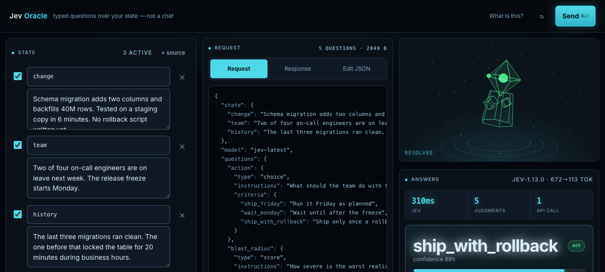

# Jev Oracle

A small web console for asking [Jev](https://docs.typesafe.ai) typed questions about
whatever you paste in.

Jev is not a chatbot. You send it some state and a map of questions, each with a
declared answer type, and it sends back one typed answer per question with calibrated
probabilities. No prose, no streaming, no persona. This app is a front end for exactly
that, built so the shape of the request stays visible the whole time.



## Why it looks like this

Most wrappers around a model hide the request and show you a sentence. That makes
everything look like an LLM, which defeats the point of a model that answers in types.

So the middle column is the actual JSON body being POSTed. It rebuilds as you type,
and you can edit it by hand and push those edits back into the controls. If you only
take one idea from this repo, take that one.

The right column shows the answers, plus three things a chat interface cannot show you:

- **How fast it was.** Jev usually answers in about 300ms no matter how many questions
  you send, because they run in parallel inside one call. The badge says so.
- **How much each source mattered.** Untick a source, send again, and the verdict shows
  the change in percentage points. That is the clearest proof the model is reading your
  state and not its own training data.
- **Whether it is stable.** Tick the consistency box to send the same question three
  times and see the spread.

## Requirements

- [Bun](https://bun.sh) 1.1 or newer
- A TypeSafe API key from the [console](https://console.typesafe.ai/keys)
- Optional: any OpenAI-compatible local model server (Ollama, LM Studio, vLLM) if you
  want the factor decomposition feature

## Running it

```bash
git clone <your-fork-url> jevoracle
cd jevoracle
cp .env.example .env      # then paste your key into it
bun run server.js
```

Open http://localhost:3737 and click one of the worked examples.

## How to use it

**State** is everything Jev sees. Add as many sources as you like. Give them labels and
they are sent as a named JSON object, which lets a question point at one of them by
name. Leave a single source unlabelled and it is sent as a plain string.

**Questions** come in three kinds, and picking the right one is most of the work:

| Kind | Ask it when | You get back |
| --- | --- | --- |
| Noul | Something is either true or it is not | The probability of yes |
| Choice | You have a fixed set of options | The winner, the full distribution, and confidence |
| Score | You want a position on a scale you define | A weighted score, the legend, and confidence |

Mark one question with the star and it becomes the headline verdict. The rest still get
answered and still get shown, just lower down.

A few things worth knowing:

- A Noul near 0.50 means the model is genuinely undecided. It does not mean "medium".
- Confidence on a Choice or Score describes how concentrated the distribution is. It is
  not a promise that the answer is correct.
- Every enabled question goes in the same call and none of them can see the others'
  answers. Ask speculative questions freely and ignore the ones that turn out not to
  apply.

## The optional bits

**Break into factors.** Jev selects and judges, it does not generate. So if you want the
question broken down, something else has to write the sub-questions. This feature asks a
local model to propose five of them, then appends every one to the same Jev request as a
Noul. The panel labels them "proposed locally, judged by Jev" so the split is never
blurred. It adds 15 to 30 seconds because the local model is the slow part. That
contrast, seconds against milliseconds, is itself informative.

Point `DECOMPOSE_URL` at any OpenAI-compatible server. Leave it blank and the checkbox
disables itself.

**Ask why.** Adds three more questions to the same call: how strongly your state supports
the outcome, how serious the obstacles are, and whether you have given it enough to
answer responsibly at all. That last one is the useful one. It will tell you when the
answer is a guess.

**Consistency check.** Sends the primary question three times and charts the spread.

## Project layout

```
server.js          Bun server. Proxies to TypeSafe, hides the key, runs decomposition.
public/
  index.html       Markup for the three columns
  app.css          All styling. Holographic palette, no framework.
  app.js           Question builder, JSON sync, answer rendering
  jev3d.js         The droid. Three.js, procedural geometry, no model files.
  favicon.svg
design-system/     Design language and UX notes written while building this
```

No build step and no dependencies. The whole front end is three files served as-is.

## Security notes

The API key stays on the server and is never sent to the browser. `/api/ask` validates
the request shape before spending an upstream call, caps bodies at 512KB, and passes
upstream errors through without leaking headers.

If you deploy this anywhere public, put authentication in front of it. As written,
anyone who can reach the page can spend your API quota.

## The droid

The wireframe thing in the corner is decorative, but it does react. It idles in cyan,
speeds up and sweeps its eye while a request is in flight, then takes the colour of the
verdict: green for a confident yes, red for a no, amber when the answer is split. It also
leans in or recoils.

It is procedural geometry, so there are no model files to download. If you find it
distracting, delete the canvas element from `index.html` and the module import at the top
of `app.js`. Nothing else depends on it. It also respects `prefers-reduced-motion`.

## Licence

MIT. See [LICENSE](LICENSE).

Jev and TypeSafe are products of TypeSafe AI. This is an unofficial client and is not
affiliated with or endorsed by them.
