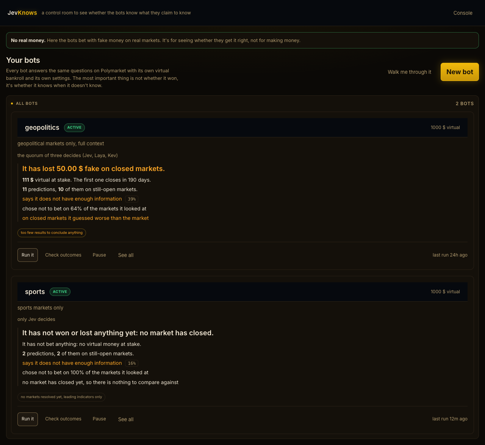
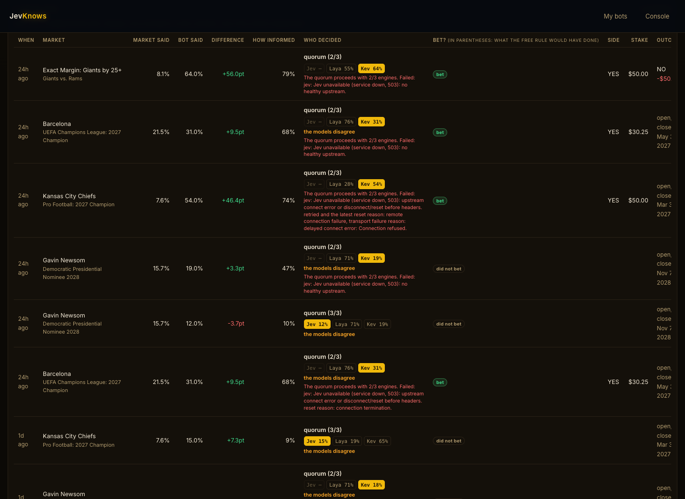
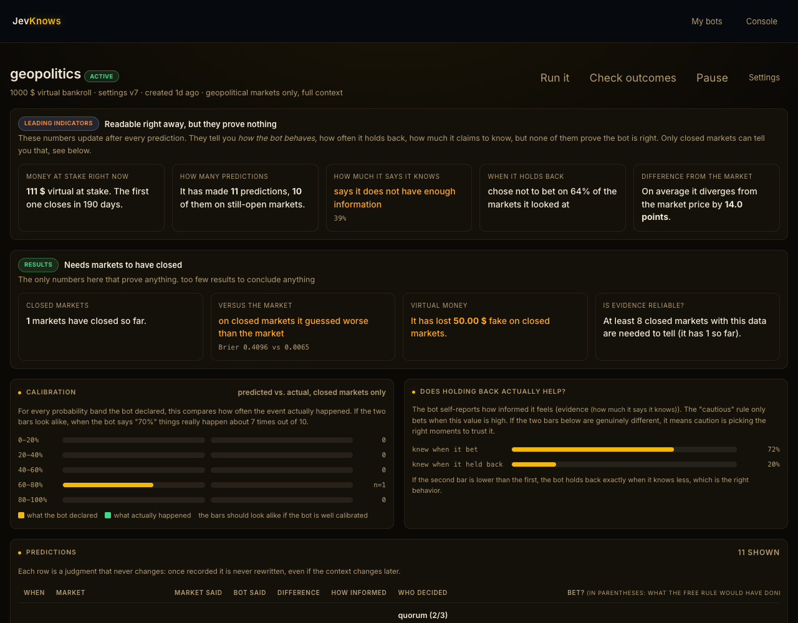
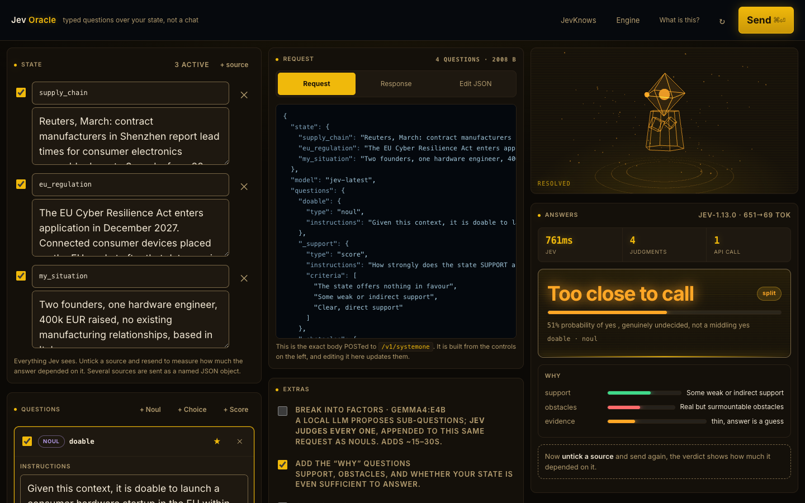

# JevKnows

A control room for prediction-market bots that bet with fake money on real markets.

Each bot has its own rules, its own bankroll and its own record. It looks at live
Polymarket markets, asks a typed-decision model what it thinks, and writes down the
answer before the outcome is known. Nothing here moves real money. The point is not
profit, it is finding out whether a model's judgment is any good, which you cannot know
until markets actually resolve.



## The idea

A prediction market gives you a price, and a price is a crowd's opinion. If you ask a
model the same question the market is pricing, you get a second opinion you can score
against reality later. Do that a few hundred times and you learn something that no
single answer can tell you: whether the model is calibrated, and whether it knows when
to keep quiet.

Three things make that measurement honest, and all three are enforced in code rather
than left to good intentions:

**The market price never reaches the model.** If it did, the model could just agree with
the crowd and look brilliant. `platform/guards.js` walks the state before every call and
throws if anything that smells like a price got in. It is an invariant, not a
convention.

**Predictions are immutable and timestamped.** A prediction is written before the market
resolves and is never edited afterwards. Each one records the exact model version that
produced it and the exact configuration in force at the time, so a threshold you change
today cannot rewrite what a number meant last week.

**Numbers that prove nothing are labelled as such.** The dashboard splits *leading*
indicators, which you can read immediately and which prove nothing, from *settled*
results, which require markets to have actually resolved. A number that cannot be
computed renders as missing, never as zero.

## Three engines, and what happens when they disagree

The same typed question can be answered by three interchangeable engines. They share the
same primitives, so the code does not care which one replies except to record it.

| Engine | Where it runs | Cost | Latency on real state |
| --- | --- | --- | --- |
| [Jev](https://docs.typesafe.ai) (TypeSafe System One) | Remote API | Free tier, metered by call | 0.4 to 0.9s |
| [Laya](https://github.com/NandhaKishorM/laya) | Local, Python in-process | Free, unmetered | 1.9 to 7.4s |
| [Kev](https://github.com/jaredpalmer/kev) | Local, HTTP server | Free, unmetered | 7 to 19s |

By default all three answer and the result is a weighted quorum. This is where it gets
interesting, because they frequently do not agree:



| Market | Crowd price | Jev | Laya | Kev |
| --- | --- | --- | --- | --- |
| Kansas City Chiefs, 2027 champion | 0.076 | 0.150 | 0.188 | **0.650** |
| Barcelona, 2027 Champions League | 0.215 | 0.150 | **0.757** | 0.310 |
| Gavin Newsom, 2028 nominee | 0.157 | did not answer | **0.713** | 0.180 |

Those are rows straight out of the current record, including the last one, where Jev
was down and the quorum closed with two engines instead of refusing to answer.

Jev tracks the crowd closely and is stable across repeated runs. Laya swings wildly on
*some* inputs and not others, which is worse than being consistently wrong because you
cannot predict it. Kev sits in between but breaks away on its own markets. No engine is
reliably the outlier.

So the dashboard shows every engine's answer, not just the combined one, and says in
plain words when they disagree. **The disagreement is the finding.** If the three agree,
the call is robust. If they scatter, that is worth a human look, and collapsing it into
one tidy number would throw away the only useful signal.

Two consequences shaped the implementation:

- **A majority vote is meaningless on a probability.** `noul` is continuous: three
  engines saying 0.2, 0.3 and 0.9 have no majority. The quorum uses a weighted median,
  which is robust to one engine bolting. A real majority vote only applies to `choice`.
- **Weights are `jev: 3.1, laya: 1, kev: 2`.** The 3.1 is deliberate. At a flat 3, a
  Laya-plus-Kev coalition ties Jev at 3 to 3 and you need a separate tie-break rule.
  At 3.1 Jev wins by construction, so "Jev breaks ties" lives in the numbers instead of
  in a branch. Raise the others and Jev loses its veto.

When an engine fails, the quorum proceeds without it and says so rather than pretending.
That is not hypothetical: several predictions in the current record read
`quorum(laya+kev)` because the Jev service returned 503 and 529 during those runs.

## Local engines start on demand

Kev is a 4B model. Keeping it resident for a handful of runs a day is memory taken from
the rest of your machine, so nothing is kept warm by default:

- Both local engines start on the **first request that needs them**.
- They shut down after **10 minutes idle**, and on server exit.
- A server you started yourself is **adopted, not killed**. It stays yours.
- `GET /api/engines` reports status, `POST /api/engines` stops them now.

The trade is explicit: the first request after a pause pays the warm-up (about 50s for
Kev), and subsequent ones do not. For a platform that does a few runs a day that is the
right direction to be wrong in.

## What a bot actually does

```
pick candidate markets  ->  drop the ones already expired or closing too far out
                        ->  build state (rules, timing, recent reporting; never the price)
                        ->  assert no price leaked in
                        ->  ask the engines
                        ->  record the prediction, whether or not it bets
```

Two rules are scored side by side on every market: a **gated** rule that only bets when
the model says it has enough evidence, and an **ungated** rule that ignores that gate.
Only the gated rule commits the bankroll; the ungated one is recorded as a hypothetical
so the gate itself can be judged later. The UI keeps them visually distinct, because a
simulated stake shown like a real one is a lie.

By default a bot ignores markets resolving more than **7 days out**. A market 250 days
away ties up the bankroll for eight months and teaches you nothing in the meantime.
This filter runs *before* the engines are called, so a skipped market costs nothing.

One measured consequence: of the 60 highest-volume Polymarket events, only 13 close
within 7 days and 29 are more than 30 days out. With a short horizon the candidate pool
has to be widened or you come back empty, so the search widens while the cap on engine
calls stays put.

## Settlement

A bet closes when Polymarket publishes the outcome, which is not the same as the
market's end date and can lag it by days. A scheduler asks every 15 minutes and is
free, because it only talks to Polymarket. Until something actually resolves, the
dashboard says so instead of showing an encouraging zero.

## Running it

```bash
git clone https://github.com/tcsenpai/jevoracle.git
cd jevoracle
cp .env.example .env      # paste your TypeSafe key into it
bun run server.js
```

Open http://localhost:3737. With no bots yet, the empty state offers a guided setup that
explains what a bot is before asking you to configure one.

Requirements:

- [Bun](https://bun.sh) 1.1 or newer
- A TypeSafe API key from the [console](https://console.typesafe.ai/keys)

That is the whole hard requirement. Everything else is optional and documented in
`.env.example`. There is no build step, no bundler and no npm dependency tree: the
frontend is native ES modules served straight from disk.

### Optional: the local engines

**Both Laya and Kev are optional.** Jev alone runs the platform fine. Without them the
quorum simply degrades to whoever answered and labels the result honestly, so you can
add one, both or neither, at any time, without touching a bot's configuration.

Add them when you want a second and third opinion at no quota cost, or when you want to
experiment at a volume that would burn through Jev's free tier.

**Laya** is a Python library that runs in-process through a bridge:

```bash
uv pip install laya          # or: pip install laya
```

One gotcha worth knowing up front: it often lands in a virtualenv rather than the
system interpreter, and the bridge has to use the one that actually has it. Point
`LAYA_PYTHON` at that interpreter if `import laya` fails from your default `python3`.

```bash
python3 -c "import laya; print(laya.__file__)"   # if this fails, set LAYA_PYTHON
```

**Kev** is an HTTP server speaking the same API as Jev, so the platform talks to it
exactly as it talks to Jev:

```bash
git clone https://github.com/jaredpalmer/kev.git
cd kev && uv sync --extra serve
KEV_DTYPE=bf16 KEV_MERGE=0 uv run --extra serve \
  python -m kev.serve --run jaredpalmer/kev-4b --port 8009
```

`KEV_MERGE=0` is not decoration. Without it the fp32 LoRA merge on Apple Silicon takes
minutes and prints nothing, so a working start looks identical to a hang. Set
`KEV_HOME` to the clone directory and the platform will start and stop the server for
you on demand; otherwise run it yourself and it will be adopted rather than managed.

Two more traps, both of which cost real debugging time, are written up with their fixes
in `platform/ENGINES.md`: `--run <model>@<revision>` is silently rejected by an upstream
regex, and a bare GET against `/v1/systemone` makes a healthy server look dead.

Check what is up at any time:

```bash
curl -s localhost:3737/api/engines
```

## The dashboard



Every technical number is paired with a sentence saying what it means, because the
audience is one person deciding whether to trust a bot, not a trading desk. "Mean
evidence 11%" becomes "says it does not have enough information".

The metrics worth knowing:

- **Evidence** is the model's own claim about whether it had enough to go on. It is
  self-reported, so the dashboard also checks whether high-evidence calls are actually
  more accurate. Until there are enough settled markets to test that, it says so.
- **Abstention** is how often a bot passed. A bot that declines most markets is not
  broken; a bot that bets on everything usually is.
- **Brier score** against the crowd is the only number that proves anything, and it needs
  resolved markets. Below 20 settled predictions the dashboard refuses to draw
  conclusions from it.

## The console

The original single-question playground lives on at `/console`.



It exists because most wrappers around a model hide the request and show you a sentence.
Here the JSON you are about to send stays on screen, editable, the whole time. Three
question types, and picking the right one is most of the work:

| Kind | Ask it when | You get back |
| --- | --- | --- |
| Noul | Something is either true or it is not | The probability of yes |
| Choice | You have a fixed set of options | The winner, the full distribution, and confidence |
| Score | You want a position on a scale you define | A weighted score, the legend, and confidence |

Worth knowing:

- A Noul near 0.50 means genuinely undecided. It does not mean "medium".
- Confidence on a Choice or Score describes how concentrated the distribution is. It is
  not a promise that the answer is correct.
- Every question goes in one call and none can see the others' answers. Ask speculative
  ones freely and ignore the ones that turn out not to apply.

## Layout

```
platform/     the multi-bot platform: runner, quorum, engines, metrics, settlement
engine/       the original single-bot paper-trading loop
public/       the frontend, native ES modules, no build step
scripts/      Polymarket fetching and request building
docs/         screenshots and the engine write-up
```

`platform/ENGINES.md` covers running the local engines, including three startup traps
that cost real time to diagnose. `platform/LAYA.md` covers the Python bridge.

## Honest limits

- **No real trading.** Polymarket has no testnet and pUSD is a real ERC-20 on Polygon
  mainnet, so live execution is guarded behind four separate locks and is not wired up.
  The guard ships; the trigger does not.
- **Almost nothing has settled yet.** At the time of writing, exactly one market has
  resolved, and it lost 50 fake dollars. One result proves nothing in either direction,
  which is precisely what the maturity labels on screen say. The calibration curve is a
  work in progress and the dashboard refuses to draw conclusions from it below 20
  settled predictions.
- **Jev's free tier is metered.** A three-engine quorum spends that quota three times
  faster than Jev alone. A Laya-plus-Kev quorum costs nothing and is a reasonable way to
  experiment at volume.
- **Local engines are slow on real state.** Kev answers a short prompt in 306ms but takes
  7 to 19 seconds on a full market state. Jev stays under a second throughout.

## Licence

MIT.
